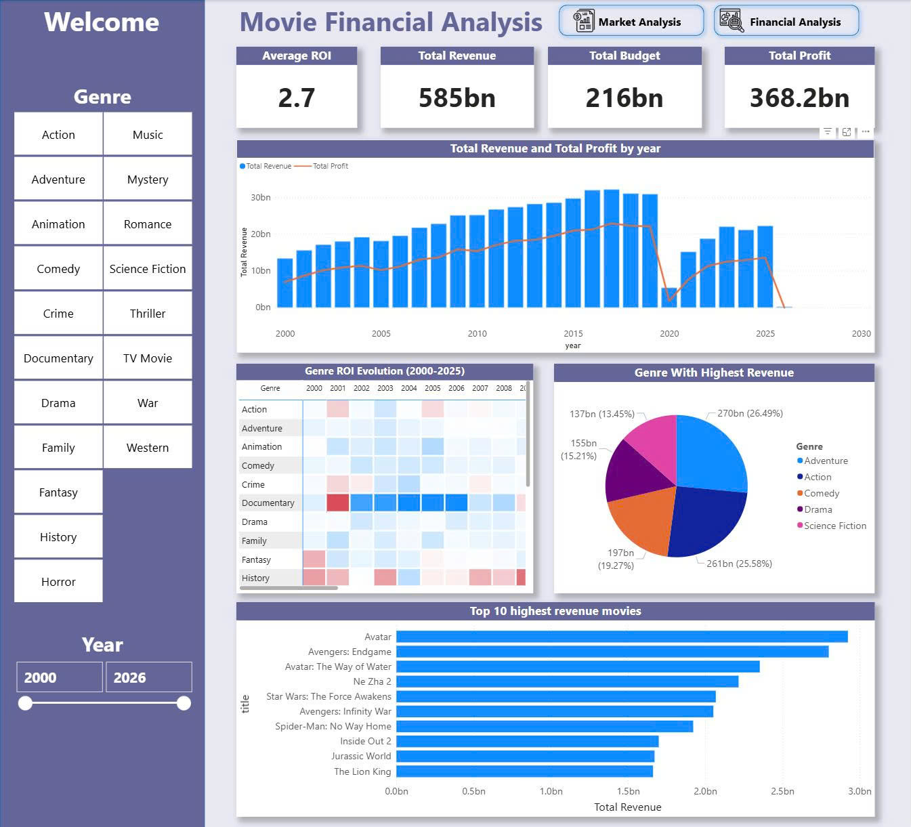
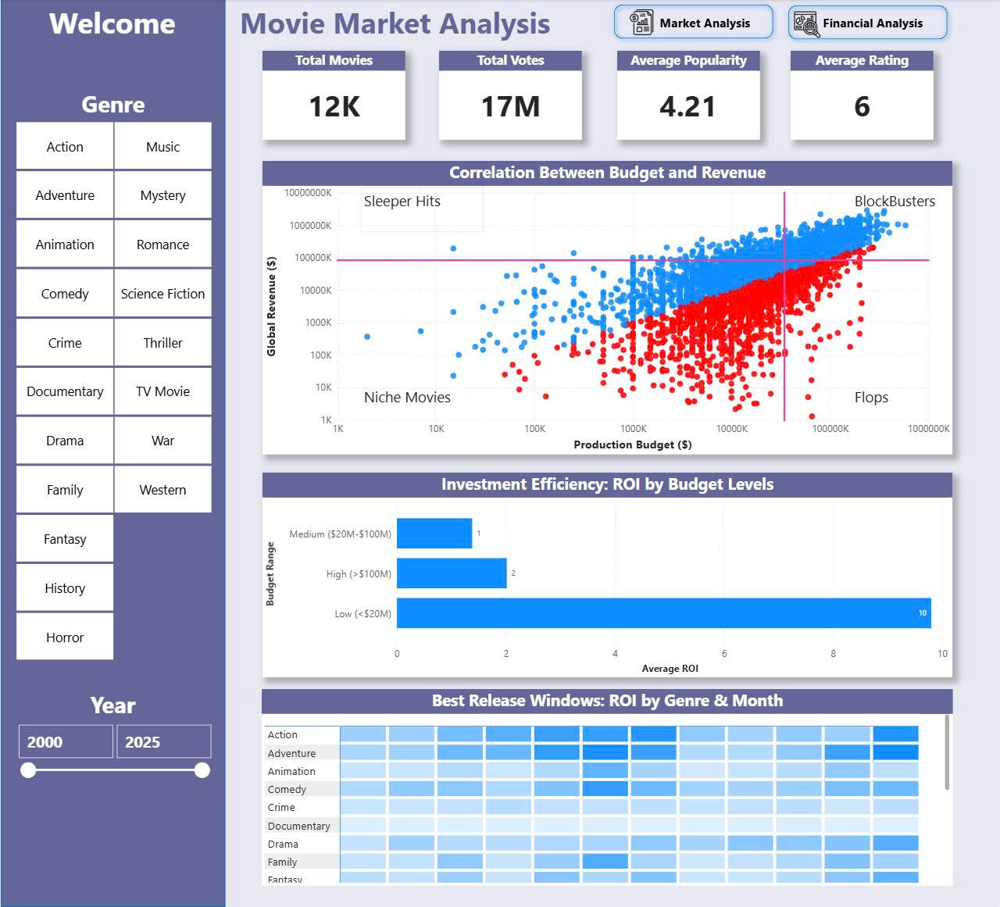
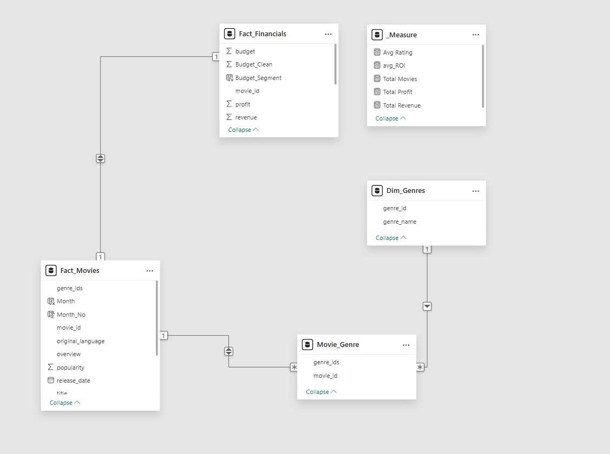

#  End-to-End Movie Data Engineering Pipeline

> **Automated ETL System & Financial Analytics (2000-2026)**

  

## 1. Project Overview
**The Context:** The film industry faces a "ROI Paradox" post-2020. While revenues are recovering, profit margins are shrinking due to inflation.
**The Goal:** Build an automated pipeline to ingest, clean, and analyze 26 years of movie data (12,000+ records) to find safe investment strategies.

---

## 2. System Architecture
**Data Flow:** TMDB API -> Python Scripts (ETL) -> SQL Server (Data Warehouse) -> Power BI (Dashboard).

### Technical Highlights
* **Incremental Load:** The system automatically checks the database and only fetches *new* movies (`auto_etl.py`).
* **Multithreading:** Utilized 8 concurrent workers to speed up financial data extraction by 10x (`financial.py`).
* **Robustness:** Automated logging, error handling for API limits, and daily CSV backups.

---

## 3. Data Visualization (Dashboard)
The pipeline feeds data into Power BI for visual analysis.

### Financial Dashboard Overview

*(Key Financial KPIs: Revenue Growth vs Profit Trends (2000-2025) & Top 10 Blockbusters)*

### Market & Strategy Dashboard

*(Risk Analysis: The "Budget Trap" Scatter Plot & ROI Efficiency by Budget Levels)*

### Data Model (Star Schema)

*(Optimized Star Schema for high-performance querying)*

---

## 4. Key Business Insights
Based on the analysis of 12,000+ movies:

### Insight 1: The Efficiency Paradox (ROI vs Budget)
* **Finding:** Data proves the "Law of Diminishing Returns". Low-budget films (<$20M) achieve an average **ROI of ~10x**, while Blockbusters (>$100M) only average an **ROI of ~2x**.
* **Strategy:** Invest in a portfolio of 20 mid-budget films rather than betting on 1 mega-blockbuster to maximize capital efficiency.

### Insight 2: The $150M "Death Zone"
* **Finding:** The Scatter Plot reveals a "Budget Trap". Movies with production budgets exceeding **$150M** show a significantly higher density of financial failures (Red dots) due to the massive break-even point requirement.
* **Implication:** A strict Budget Cap of $150M is recommended for non-franchise projects to minimize risk.

### Insight 3: The "Dump Months" Arbitrage
* **Finding:** While Summer is for Action movies, **January & February** (historically "dump months") are actually Gold Mines for **Romance & Drama** genres with high ROI due to low market competition.
* **Strategy:** Avoid releasing Drama films in May-July; target Q1 or Q4 instead.

---

## 5. How to Run
1.  **Clone repo:** `git clone https://github.com/ElysiaTheElysier/Movie-Analysis-Pipeline.git`
2.  **Install requirements:** `pip install -r requirements.txt`
3.  **Config:** Set API Key in `Script/config.py`.
4.  **Run:** Execute `Run_pipeline.bat`.

---
## 6. Interactive Demo & Full Report
To fully evaluate the analytical depth and technical interactivity of this project, please refer to the resources below:

### 📑 Deep-Dive Market Report (PDF)
👉 **[Read the Full PDF Report Here](Movie_Industry_Analysis_Report_2026.pdf)**

---
*Author: Lam Hai Duong*
