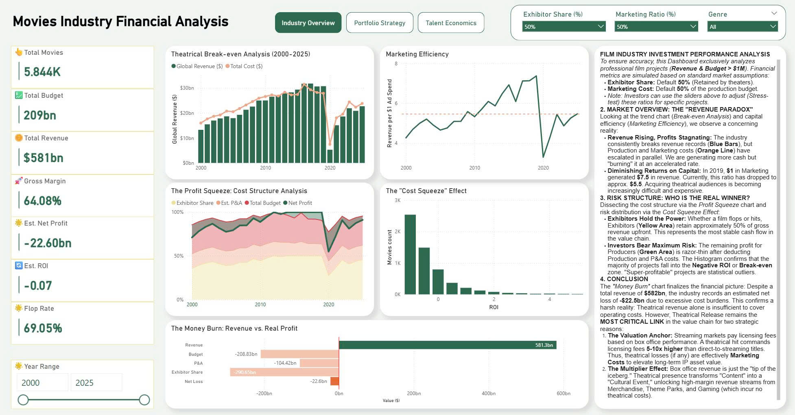
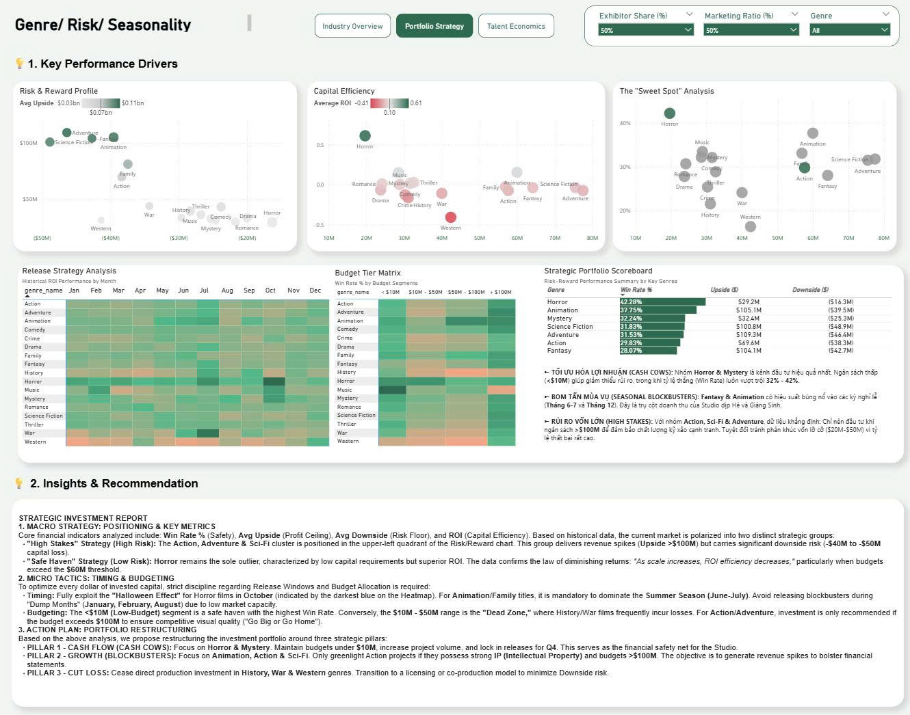
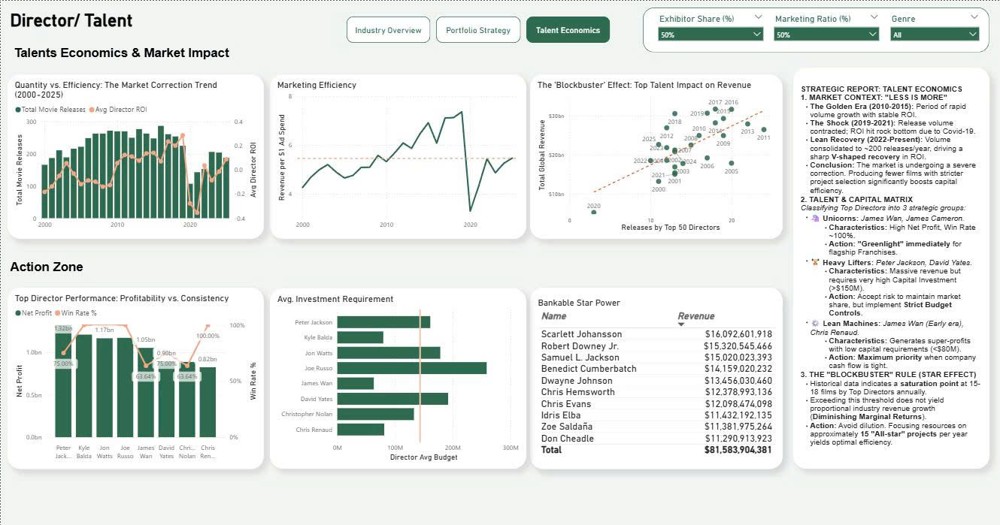
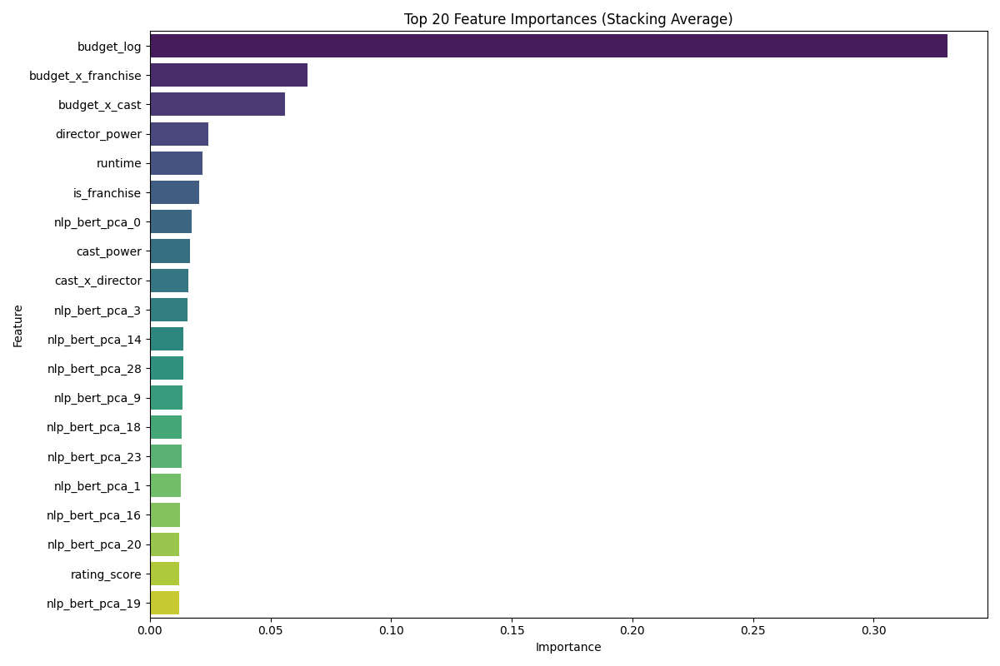

#  Capital Efficiency in the Post-Digital Film Industry
### An End-to-End Machine Learning & BI Framework for ROI Prediction

> **Executive Summary:**  
> The film industry is facing a **Revenue Paradox** — while Gross Box Office reaches record highs, **Net Profit Margins are collapsing** under marketing inflation and production cost squeeze.  
> This project moves beyond vanity metrics toward **Capital Efficiency**, using a **26-year dataset (2000–2025)** to identify safe investment zones and predict ROI with Machine Learning.

---

## ⚙️ System Architecture – Data Pipeline

The system automates the journey from raw API data to investor-ready insights.

TMDB API  
→ Raw JSON  
→ Python ETL (Cleaning & Business Logic)  
→ SQL Server Data Warehouse (Star Schema)  
→ Power BI (Dashboards)  
→ Stacking ML Model (Training Data)  
→ Predictions  
→ Strategic Insights  
→ Investor Report  

**Key Design Choices**
- **Data Filters:** Commercial films only (Revenue > $1M, Budget > $1M)
- **Interactive Controls:**
  - Marketing Cost Slider (investor-adjustable)
  - Exhibitor Revenue Share (default 50%)

---

##  Phase 1 — Strategic Market Analysis (Business Intelligence)

### 1. Industry Health Check — *The Profit Squeeze*

**Dashboard: Industry Financial Overview**

**A. Revenue Paradox (Theatrical Break-even Analysis)**  
- From 2010–2019, revenue hit all-time highs while total costs rose in parallel  
- Profit margin gap has effectively vanished  
- **Theatrical release is no longer a profit center — it is a marketing channel**  
- Acts as a price anchor for streaming rights and IP validation for merchandise

**B. Marketing Efficiency Collapse**  
- Revenue per $1 ad spend fell from **$7.5 (2019)** to **~$5.5 post-2020**  
- Customer acquisition costs have structurally increased

**C. Cost Structure Reality**  
- Exhibitor share ≈ 50% of GBO (largest fixed cost)  
- During 2020, profits disappeared entirely  
- Studios absorb risk; cinemas take guaranteed revenue

**D. Waterfall Analysis — Money Burn**  
- Total revenue: $582B  
- Net industry loss: **–$22.5B**  
- Exhibitor share (–$291B) exceeds production budgets (–$209B)  
- The theatrical model survives only via downstream revenue (streaming & licensing)

---

### 2. Portfolio Strategy — *The Barbell Model*
**Dashboard: Risk, Reward & Seasonality**

**A. Risk vs Reward**
- Action / Adventure: High upside, extreme downside volatility  
- Drama / Comedy: Low risk, limited upside  
- Blockbusters generate spikes but behave like financial options

**B. Capital Efficiency Curve**
- ROI collapses beyond $60M budgets  
- Horror ($15–20M) consistently delivers the highest ROI  
- **Bigger is not better**

**C. Release Timing & Budget Matrix**
- Horror peaks in October (Halloween Effect)  
- Animation / Fantasy peak in June–July  
- Mid-budget films ($20–50M) statistically underperform  
- Strategy: **Go Big or Go Lean — avoid the middle**

---

### 3. Talent Economics — *Unicorns vs High Rollers*
**Dashboard: Director & Talent Performance**

**A. Market Correction**
- 2010–2015: High volume, high ROI  
- 2019–2021: ROI collapse  
- 2022–Present: Fewer films, higher efficiency

**B. Talent Segmentation**
- **Unicorns:** High ROI + high win rate → Greenlight immediately  
- **High Rollers:** High revenue, high risk → Budget caps & profit sharing  
- **Safe Hands:** Stable ROI → Portfolio stabilizers

**C. Blockbuster Saturation**
- Beyond ~18 top-tier releases per year, marginal revenue declines

---

##  Phase 2 — Predictive Modeling (Machine Learning)

**Objective:** Predict box office revenue *before production begins*

**Feature Engineering**
- Rolling historical star-power (no data leakage)
- CPI-adjusted financials (2024 USD)
- Log-transformed revenue targets

**Model Performance**

| Model | RMSE (Log) | R² |
|------|-----------|----|
| Linear Regression | 1.1438 | 0.6082 |
| XGBoost | 1.1021 | 0.6362 |
| **Stacking Ensemble (Final)** | **1.1002** | **0.6374** |

Key drivers remain **Budget** and **Franchise Status**, confirming the pay-to-play nature of modern cinema.

---

##  Final Investment Playbook

Based on **5,844 films**:

1. **Defensive (40%)**  
   Horror / Thriller < $10M, October releases  
2. **Offensive (40%)**  
   Franchise IPs > $100M, Summer releases  
3. **Risk Control**  
   Exit History / War production → licensing only  
4. **Talent Policy**  
   Prioritize directors with historical ROI > 0.1  

---

## How to Run

Clone repository  
git clone https://github.com/YourRepo/Movie-Analysis-Pipeline.git

Install dependencies  
pip install -r requirements.txt

Run pipeline  
python src/feature_engineering.py  
python src/train_model.py  

Launch app  
streamlit run app.py

---

**Author:** Lam Hai Duong  
*Analyzing the Art of Film with the Science of Data*
