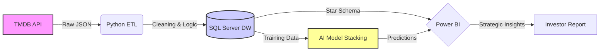

```markdown
# 🎬 Capital Efficiency in the Post-Digital Film Industry
### An End-to-End Machine Learning & BI Framework for ROI Prediction


> **Executive Summary:** The film industry is facing a **"Revenue Paradox"**—while Gross Box Office creates record-breaking headlines, Net Profit Margins are collapsing due to the "Cost Squeeze" of marketing and production inflation. This project moves beyond vanity metrics to engineered **Capital Efficiency**, utilizing a 26-year dataset (2000-2025) to identify "Safe Harbor" investment zones and predict ROI with Machine Learning.

---

##  System Architecture: The Data Pipeline

The system automates the journey from raw API data to actionable AI insights.


```mermaid
graph LR
    A[TMDB API] -->|Raw JSON| B(Python ETL)
    B -->|Cleaning & Logic| C[(SQL Server DW)]
    C -->|Star Schema| D{Power BI}
    C -->|Training Data| E[AI Model Stacking]
    E -->|Predictions| D
    D -->|Strategic Insights| F[Investor Report]
    
    style A fill:#f9f,stroke:#333,stroke-width:2px
    style C fill:#ccf,stroke:#333,stroke-width:2px
    style E fill:#ff9,stroke:#333,stroke-width:2px

```

* **Data Filters:** Commercial films only (Revenue & Budget > $1,000,000).
* **Interactive Controls:** Marketing Cost Slider (Investor adjustable) & Exhibitor Share (Default 50%).

---

##  Phase 1: Strategic Market Analysis (Business Intelligence)

### 1. The Industry Health Check: "The Profit Squeeze"

**Dashboard: Industry Financial Overview**


* **A. The Revenue Paradox (Theatrical Break-even Analysis)**
* **The Trend:** From 2010-2019, while Revenue (Green bars) reached all-time highs, the Total Cost line (Blue) paralleled it closely.
* **The Insight:** We are earning more, but burning cash faster. The profit margin gap has been erased.
* **Strategy Shift:** Theatrical release is no longer a Profit Center but a Marketing Center. It serves as a "Price Anchor" for streaming rights and an "IP Validator" for merchandise.


* **B. Marketing Efficiency Collapse**
* **The Metric:** Revenue per $1 Ad Spend.
* **The Fall:** In 2019 (Golden Era), $1 of marketing generated **$7.5** in revenue. Post-2020, this efficiency dropped to **~$5.5**.
* **Conclusion:** Customer acquisition costs have skyrocketed. It is significantly harder and more expensive to lure audiences to theaters than it was a decade ago.


* **C. The Profit Squeeze (Cost Structure)**
* **Exhibitor Share (Yellow):** Takes ~50% of GBO immediately. This is the largest fixed cost.
* **The 2020 Collapse:** The profit layer (Green) vanished completely during the pandemic, revealing a fragile financial structure where costs often exceed 90% of revenue.
* **The Reality:** Studios bear all production risks, but cinemas take the guaranteed share.


* **D. The Money Burn (Waterfall Analysis)**
* **The Shocking Truth:** Despite generating $582bn in total revenue, the industry shows a net loss of **-$22.5bn**.
* **The Culprit:** The "Exhibitor Share" column (-$291bn) is larger than the Production Budget (-$209bn). The traditional business model is broken at the theatrical level, relying entirely on downstream revenue (Streaming/TV) to recoup losses.


---

### 2. Portfolio Strategy: The "Barbell" Investment Approach

**Dashboard: Risk, Reward & Seasonality**


* **A. Risk vs. Reward Profile**
* **High Stakes (Action/Adventure):** High Upside (>$100M) but severe Downside (-$40M to -$50M). A volatile game.
* **Safe Zone (Drama/Comedy):** Low risk (-$20M downside), but limited upside.
* **The Strategy:** To achieve cash flow spikes, we must invest in Action, but it's a high-risk gamble.


* **B. Capital Efficiency Curve**
* **Law of Diminishing Returns:** As budgets increase (>$60M), ROI plummets toward zero.
* **The Outlier:** Horror at the **$15M-$20M** range is the "King of Efficiency," consistently delivering the highest ROI. *"Bigger is not always Better."*


* **C. Release Strategy & Budget Matrix (Heatmaps)**
* **The "Halloween Effect":** Horror films released in October show the darkest green (highest win rate). Missing this window means losing 30-40% potential profit.
* **The "Summer Blockbusters":** Animation/Fantasy must target June-July.
* **The "Death Valley":** Mid-budget films ($20M-$50M), especially in History/War genres released in Q1, are statistically destined to fail.
* **Budget Strategy:** Go Big (>$100M for spectacles) or Go Lean (<$10M for Horror). Avoid the middle ground.


---

### 3. Talent Economics: "Unicorns" vs. "High Rollers"

**Dashboard: Director & Talent Performance**


* **A. Quantity vs. Efficiency (Market Correction)**
* **Phase 1 (2010-2015):** High Volume (~300 movies), High ROI. The Golden Era.
* **Phase 2 (2019-2021):** ROI crashed.
* **Phase 3 (2022-Present):** "Less is More". Volume dropped to ~200 movies, but ROI spiked back to positive. The market is purging inefficient talent and projects.


* **B. The Talent Matrix (Strategy)**
*  **Unicorns (e.g., James Cameron, James Wan):** High Profit + High Win Rate (>90%). *Action: Greenlight Immediately. Give them flagship IPs.*
*  **High Rollers (e.g., Nolan, Jackson):** Massive Revenue but lower Win Rate (60-70%) & High Budgets. *Action: Strict Controls. Apply hard budget caps and profit-sharing models to mitigate risk.*
*  **Safe Hands (e.g., Jon Favreau):** Consistent Win Rate (>80%) but moderate upside. *Action: Portfolio Stabilizers. Use them for sequels and reboots to ensure financial safety.*


* **C. The "Blockbuster" Saturation**
* Data shows that increasing the number of top-tier director releases beyond 18 per year yields diminishing returns on total industry revenue. The market has a saturation point for blockbusters.


---

##  Phase 2: Predictive Modeling (Machine Learning)

To operationalize these insights, I built a **Stacking Ensemble Regressor** to predict Box Office Revenue before production begins.

### Feature Engineering

* **Time-Travel Rolling Features:** Calculated Star Power (Cast/Director) using *only* past data to prevent data leakage.
* **Inflation Adjustment:** All financial metrics normalized to 2024 USD (CPI-Adjusted).
* **Log-Transformation:** Handled extreme revenue skewness.

### Model Performance

The Stacking Model (combining XGBoost, Gradient Boosting, LightGBM) achieved the lowest error rate, outperforming traditional Linear Regression.

| Model | RMSE (Log Scale) | R² Score |
| --- | --- | --- |
| Linear Regression | 1.1438 | 0.6082 |
| XGBoost | 1.1021 | 0.6362 |
| **Stacking Ensemble (Final)** | **1.1002** | **0.6374** |


> *Budget and Franchise status remain the dominant predictors, confirming the "Pay-to-Play" nature of modern blockbusters.*

---

##  Final Recommendation: The Action Plan

Based on data from **5,844 films**, the following Investment Guidelines are proposed:

1. **Defensive Allocation (40% Capital):** Focus on Horror/Thriller films with budgets <$10M. Release in October. These are the statistical "Safety Net."
2. **Offensive Allocation (40% Capital):** Invest in Franchise IP (Animation/Action) with budgets >$100M. Release in Summer (June/July). Avoid the $20M-$50M "Dead Zone."
3. **Risk Mitigation:** Stop direct production investment in History/War genres. Transition these to licensing models to minimize downside risk.
4. **Talent Management:** Prioritize directors with a historical ROI > 0.1. Move away from volume-based hiring to efficiency-based hiring.

---

##  How to Run

1. **Clone the Repo:**
```bash
git clone [https://github.com/YourRepo/Movie-Analysis-Pipeline.git](https://github.com/YourRepo/Movie-Analysis-Pipeline.git)

```


2. **Install Requirements:**
```bash
pip install -r requirements.txt

```


3. **Run Pipeline (ETL + Training):**
```bash
# Step 1: Fetch and Process Data
python src/feature_engineering.py

# Step 2: Train AI Model
python src/train_model.py

```


4. **Launch App:**
```bash
streamlit run app.py

```


---

**Author:** Lam Hai Duong

*Analyzing the Art of Film with the Science of Data.*

```

```