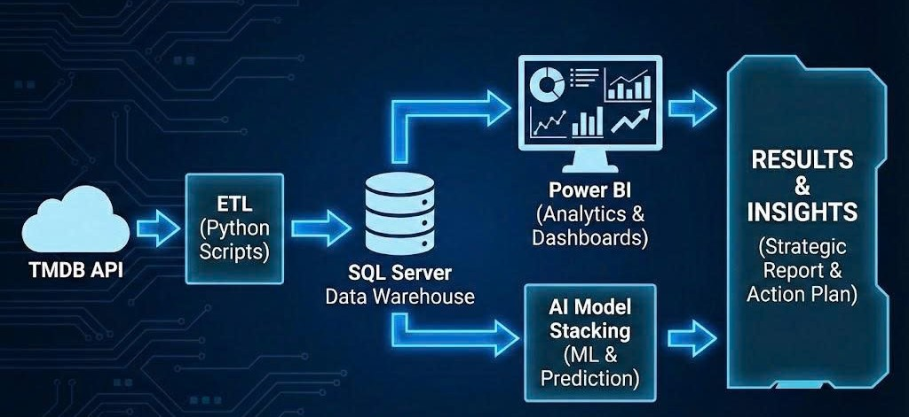

# 🎬 Capital Efficiency in the Post-Digital Film Industry
### An End-to-End Machine Learning & BI Framework for ROI Prediction


> **Executive Summary:**
> The film industry is facing a **Revenue Paradox** — while Gross Box Office reaches record highs, **Net Profit Margins are collapsing** under marketing inflation and production cost squeeze.
> This project moves beyond vanity metrics toward **Capital Efficiency**, using a **26-year dataset (2000–2025)** to identify safe investment zones and predict ROI with Machine Learning.

## 🌐 Live Demo Access
👉 **[Click here to view Interactive Power BI Dashboard](https://app.powerbi.com/view?r=eyJrIjoiN2Q0ZjcxY2EtNmRlNy00Y2VjLTg4MGQtZDE5YjRlYmYyY2U5IiwidCI6IjVlOGIzMjY5LTc2Y2EtNDU3Yy04NDdmLTQ0NGUzZGI5ODZhNyIsImMiOjl9)**
*(Explore the Profit Squeeze, Portfolio Strategy, and Talent Economics in real-time)*

👉 **[Click here to try the AI Prediction App (Streamlit)](https://movie-analysis-pipeline-dzzjekfixsnlpq9ytgw2tx.streamlit.app/)**
*(Input your movie idea and get an instant ROI prediction)*

---

## ⚙️ System Architecture – The Data Pipeline

The system automates the journey from raw API data to investor-ready insights and ML Model.



**Key Design Choices**
- **Data Filters:** Commercial films only (Revenue > $1M, Budget > $1M)
- **Interactive Controls:**
  - Marketing Cost Slider (Investor-adjustable)
  - Exhibitor Revenue Share (Default 50%)

---

## 📊 Phase 1 — Strategic Market Analysis (Business Intelligence)

### 1. Industry Health Check — *The Profit Squeeze*

**Dashboard: Industry Financial Overview**


* **A. Revenue Paradox (Theatrical Break-even Analysis)**
    * From 2010–2019, revenue hit all-time highs while total costs rose in parallel.
    * The profit margin gap has effectively vanished.
    * **Conclusion:** Theatrical release is no longer a profit center — it is a marketing channel (Price anchor for streaming & IP validation).

* **B. Marketing Efficiency Collapse**
    * Revenue per $1 ad spend fell from **$7.5 (2019)** to **~$5.5 (Post-2020)**.
    * Customer acquisition costs have structurally increased.

* **C. Cost Structure Reality**
    * Exhibitor share ≈ 50% of GBO (largest fixed cost).
    * During 2020, profits disappeared entirely. Studios absorb risk; cinemas take guaranteed revenue.

* **D. Waterfall Analysis — Money Burn**
    * Total Revenue: **$582B** vs. Net Industry Loss: **–$22.5B**.
    * The theatrical model survives only via downstream revenue (streaming & licensing).

---

### 2. Portfolio Strategy — *The Barbell Model*

**Dashboard: Risk, Reward & Seasonality**


* **A. Risk vs Reward**
    * **Action / Adventure:** High upside, extreme downside volatility.
    * **Drama / Comedy:** Low risk, limited upside.
    * *Insight:* Blockbusters generate spikes but behave like high-risk financial options.

* **B. Capital Efficiency Curve**
    * ROI collapses beyond **$60M** budgets.
    * **Horror ($15–20M)** consistently delivers the highest ROI. *"Bigger is not better."*

* **C. Release Timing & Budget Matrix**
    * **Horror:** Peaks in October (Halloween Effect).
    * **Animation / Fantasy:** Peak in June–July (Summer Window).
    * **Mid-budget ($20–50M):** Statistically underperform ("The Death Valley").

---

### 3. Talent Economics — *Unicorns vs High Rollers*

**Dashboard: Director & Talent Performance**


* **A. Market Correction**
    * **2010–2015:** High volume, High ROI.
    * **2019–2021:** ROI Collapse.
    * **2022–Present:** "Less is More" — Fewer films, higher efficiency.

* **B. Talent Segmentation**
    * 🟢 **Unicorns:** High ROI + High Win Rate → *Greenlight immediately.*
    * 🟡 **High Rollers:** High Revenue, High Risk → *Apply budget caps.*
    * 🔵 **Safe Hands:** Stable ROI → *Portfolio stabilizers.*

* **C. Blockbuster Saturation**
    * Beyond ~18 top-tier releases per year, marginal revenue declines.

---

## 🤖 Phase 2 — Predictive Modeling (Machine Learning)

**Objective:** Predict box office revenue *before production begins*.

**Feature Engineering**
- **Time-Travel Rolling Features:** Calculated star-power using only past data (No leakage).
- **Inflation Adjustment:** All financials normalized to 2024 USD (CPI-Adjusted).
- **Log-Transformation:** Handled extreme revenue skewness.

**Model Performance**

| Model | RMSE (Log) | R² |
| :--- | :---: | :---: |
| Linear Regression | 1.1438 | 0.6082 |
| XGBoost | 1.1021 | 0.6362 |
| **Stacking Ensemble (Final)** | **1.1002** | **0.6374** |


> *Key drivers remain **Budget** and **Franchise Status**, confirming the "Pay-to-Play" nature of modern cinema.*

---

## 🚀 Final Investment Playbook

Based on data from **5,844 films**, the following strategy optimizes capital efficiency:

1.  **Defensive Allocation (40%):** Focus on **Horror/Thriller (<$10M)** released in **October**. (The Safety Net).
2.  **Offensive Allocation (40%):** Focus on **Franchise IPs (>$100M)** released in **Summer**. (The Growth Engine).
3.  **Risk Mitigation:** Cease direct production in **History/War** genres; transition to licensing models only.
4.  **Talent Policy:** Prioritize directors with a historical **ROI > 0.1**.

---

## 💻 How to Run

### 1. Clone the Repository
```bash
git clone [https://github.com/ElysiaTheElysier/Movie-Analysis-Pipeline.git](https://github.com/ElysiaTheElysier/Movie-Analysis-Pipeline.git)
cd Movie-Analysis-Pipeline

```

### 2. Install Dependencies

```bash
pip install -r requirements.txt

```

### 3. Run Data Pipeline (ETL + Training)

*Note: Ensure your SQL Server is running and configured in `src/config.py`.*

```bash
# Step 1: Process data from SQL & Engineering features
python src/feature_engineering.py

# Step 2: Train AI Model & Save .pkl files
python src/train_model.py

```

### 4. Launch the App

```bash
streamlit run app.py

```

---

**Author:** Lam Hai Duong
*Analyzing the Art of Film with the Science of Data.*
