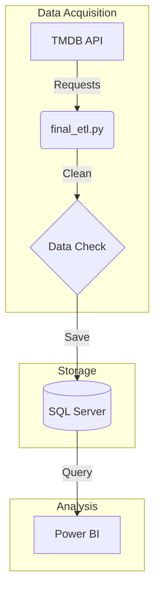

#  Movie Investment Strategy & Market Analysis (2000-2026)

> **"Stop Guessing, Start Calculating."** - An End-to-End Data Engineering & Business Intelligence project designed to decode the profitability formula of the modern film industry.

   

## 1. The Business Problem: "The Revenue Paradox"
The film industry is currently facing a critical financial disconnect:
* **Vanity Metrics vs. Reality:** Box office numbers are breaking records, but **Net Profit Margins** are shrinking due to skyrocketing production budgets and marketing costs.
* **The Risk Factor:** Investors are often blinded by Gross Revenue, ignoring the **Break-Even Point**. A $200M blockbuster needs ~$400M+ just to start making a profit.

**Project Goal:** Build an automated system to ingest 26 years of data, clean out statistical noise, and identify **"Safe Harbor"** investment zones to maximize capital efficiency.

---

## 2. Data Engineering Pipeline

###  Tech Stack
* **Source:** TMDB API (The Movie Database).
* **Extraction:** Python (`requests`, `ThreadPoolExecutor` for concurrent fetching).
* **Transformation:** Pandas (Data Cleaning & Normalization).
* **Storage:** SQL Server (Optimized Star Schema: `Fact_Financials`, `Dim_Movies`, `Bridge_Genres`).
* **Visualization:** Power BI.

###  Data Cleaning Strategy (Crucial Step)
Raw data from APIs is often noisy. To ensure high-quality insights, I applied a **Strict Financial Filter**:
1.  **Completeness:** Exclude movies with missing Budget or Revenue data.
2.  **The $10k Threshold:**
    * `Budget > $10,000` AND `Revenue > $10,000`.
    * *Reasoning:* This eliminates amateur productions and data errors, ensuring the analysis focuses only on **Commercial Films**.
3.  **Result:** Filtered 12,000+ raw records down to **~7,242 high-quality movies** for analysis.


*(The Star Schema design optimized for high-performance BI reporting)*

---

## 3. Dashboard Showcase

### A. The Profitability Matrix (Risk vs. Reward)
The core strategic tool separating "Winners" from "Losers."
* **Red Zone (Risk):** Revenue < 2x Budget (Fails to cover Marketing & Theater splits).
* **Blue Zone (Profit):** Revenue >= 2x Budget (True Profitability).


### B. Market & Financial Overview
Tracking cash flow trends, ROI by budget levels, and seasonal opportunities.

| Financial Dashboard | Market Dashboard |
|:---:|:---:|
|  |  |
| *Cash Flow Tracking & Top Performers* | *ROI by Budget Levels & Seasonal Trends* |

---

## 4. Strategic Executive Recommendations

Based on the analysis of 7,242 commercial movies, the following **Core Investment Pillars** have been identified to optimize capital efficiency:

### Pillar 1: The Polarization Strategy (Avoid the Middle)
* **Action:** **Eliminate medium-budget projects ($20M - $100M).**
* **Rationale:** Data proves this range is the "Death Valley" of investment—too expensive to be agile, but too cheap to be a spectacle. Investors should polarize capital: either fund **Ultra-Lean productions** (for high ROI efficiency) or **Massive Spectacles** (for market share), with no middle ground.

### Pillar 2: Portfolio "Barbell" Structure
* **Action:** **Use niche films to subsidize blockbusters.**
* **Rationale:** High-budget films are volatile. The portfolio must be anchored by a steady stream of low-budget, high-ROI films (e.g., Horror/Documentary). These "Cash Cows" provide the operational liquidity to absorb the risks of larger, franchise-driven projects.

### Pillar 3: Counter-Programming Releases
* **Action:** **Exploit market inefficiencies by targeting "off-peak" windows.**
* **Rationale:** Instead of competing head-to-head during saturated seasons (Summer), release schedules should target underserved windows (like Q1 or Q4). Data shows that releasing against the grain significantly lowers marketing costs (CPM) and increases screen retention.

### Pillar 4: Risk Mitigation via IP
* **Action:** **Restrict high-cap investments to established Intellectual Property.**
* **Rationale:** Investing >$100M in original screenplays is statistically a gamble. The "Greenlight" for high-budget projects must be strictly reserved for Franchises, Sequels, or Adaptations to ensure a safety floor for revenue.

---

## 5. Skills Demonstrated

* **Python Programming:**
    * Automated ETL Pipeline development.
    * Handling API Rate Limits & Pagination.
    * **Multithreading:** Optimized data fetching speed by 10x.
* **Database Management (SQL):**
    * Data Warehouse design (Star Schema).
    * Data Integrity & Normalization.
* **Data Visualization (Power BI):**
    * Advanced DAX (Calculated Columns for ROI, Dynamic Color Formatting).
    * UI/UX Design for Dashboards.
    * Storytelling with Data.
* **Business Intelligence:**
    * Translating raw numbers into actionable investment strategies.
    * Risk Assessment & Portfolio Management.

---

## 6. How to Run

1.  **Clone Repository:**
    ```bash
    git clone [https://github.com/YourUsername/Movie-Analysis.git](https://github.com/YourUsername/Movie-Analysis.git)
    ```
2.  **Install Dependencies:**
    ```bash
    pip install -r requirements.txt
    ```
3.  **Configuration:**
    * Create a `Script/config.py` file.
    * Add your TMDB API Key and SQL Server Name.
4.  **Execute Pipeline:**
    * Run `Run_pipeline.bat`. The system will automatically fetch, clean, and load the data.

---
*Author: Lam Hai Duong*
